# Famesta

### Introduction

This application is a cloned **Instagram** Web app. Following are the some features of **Famesta**
- User can login/register with the application
- User can Post the story
- Dashboard will show all the post related to user and User Followers/Followings
- Fetching Post from backend total depends upon user scroll choice
- User will be suggested by other user to follow him/her
- User can search the other user
- User can comment and Like the post Emoji also included with keyboard
- User can see whoever like the post and commented on post similar Instagram
- User can chat with his followers or other people as well
- Chat Function will similar work as **Whatsapp**
- On Feed Page user can see the different gif fetching from **GIPHY API** [Giphy Link](https://giphy.com/join?next=%2Fcreate%2Fgifmaker)
- User can manage his notification
- User can manage his profiles Editing of profile (name,profile pic etc.)
- User can't see the other User profile if it is private not followed by the user
- App will send the Link to mail for to set the forgot Password with Expiry link


### Tech Stack
1. Frontend Framework
    - Angular
    - Angular Material
    - HTTP Interceptor
    - JWT Authentication
    - AuthGuard
    - HTML, CSS, JS, TypeScript, Bootstap
    
2. Backend Frameowork
    - Django
    - DjangoRestFramework
    - Full Fledged REST API
    - MemCaching
    - Middleware
    - Python
 
 3. Deployment
    - Heroku - Frontend (different server)
    - Heroku - backend (different server)
    - AWS S3 - Storing the Static and User Media files
    

# Steps to Configure the Project

### Installing Requirements
- Python
- Angular CLI
- node

### Installing Libreries
- Open backend folder and run the below command to install required libreries for Python django
   > pip install requirements.txt
- Open Frontend folder and run the below command
   > npm install
                                                   
### AWS Configuration
- Create AWS Account [AWS](https://portal.aws.amazon.com/billing/signup#/start)
- Follow the Link to configure the AWS S3 Bucket and IAM user [Video](https://www.youtube.com/watch?v=inQyZ7zFMHM)   
- Store the Access Key and Secret Key to OS environment variable                                        
                                                   
### Configure the Enviornment Varibale for Below setting in settings.py file

```python
EMAIL_HOST_USER = os.environ.get('EMAIL_HOST_USER')
EMAIL_HOST_PASSWORD = os.environ.get('EMAIL_HOST_PASSWORD')


AWS_ACCESS_KEY_ID = os.environ.get('AWS_ACCESS_KEY_ID')
AWS_SECRET_ACCESS_KEY = os.environ.get('AWS_SECRET_ACCESS_KEY')
AWS_STORAGE_BUCKET_NAME = os.environ.get('AWS_STORAGE_BUCKET_NAME')
AWS_S3_REGION_NAME = os.environ.get('AWS_S3_REGION_NAME')
AWS_S3_FILE_OVERWRITE = False
AWS_DEFAULT_ACL = None
DEFAULT_FILE_STORAGE = 'storages.backends.s3boto3.S3Boto3Storage'
```

### Run the servers
- > python manage.py runserver
- > ng serve


#### Url Used for Locally
http://127.0.0.1:8000/api/movie/list #backend

http://localhost:4200/ #Frontend

#### Deployed Application url -

UI experience

https://famesta.herokuapp.com/

Accessing direct backend API

https://famesta.herokuapp.com/login/

### Some Snniptes
- Login
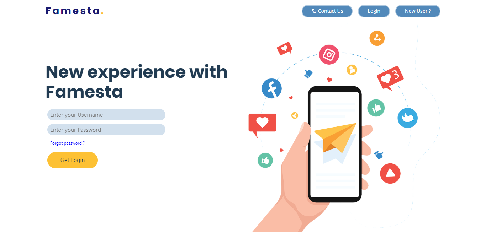
- Register
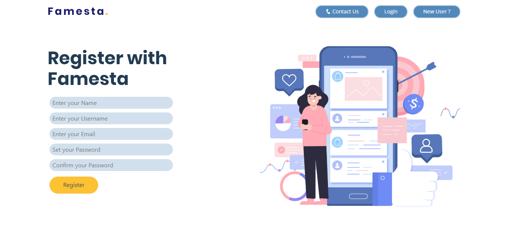
- Contact
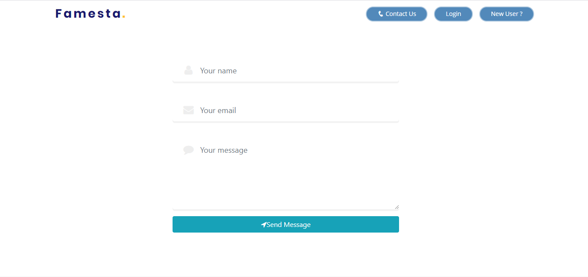
- Forgot Password
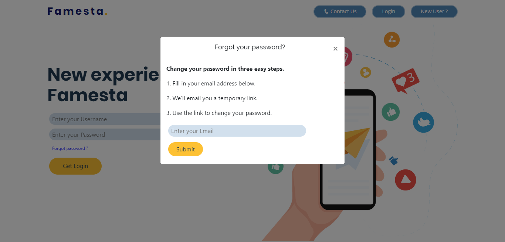
- Dashboard
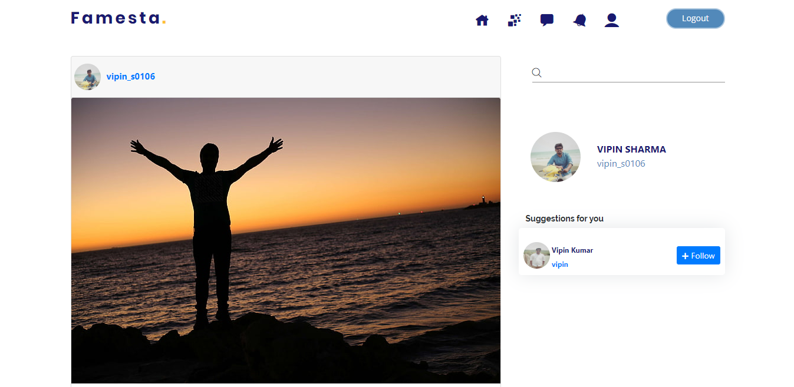
- Dashboard Comment and Like
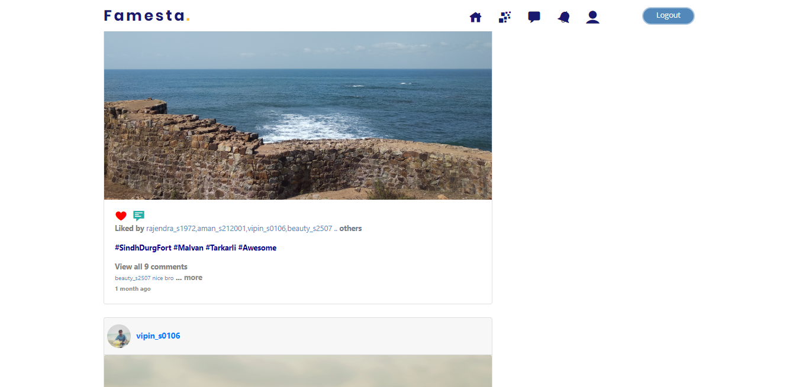
- Dashboard like page layout
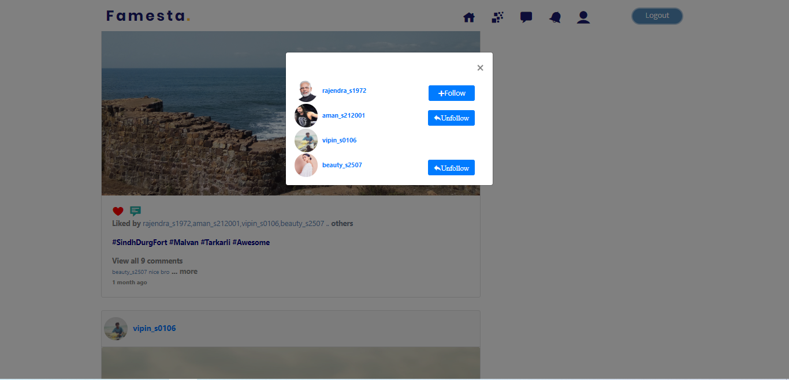
- Search User
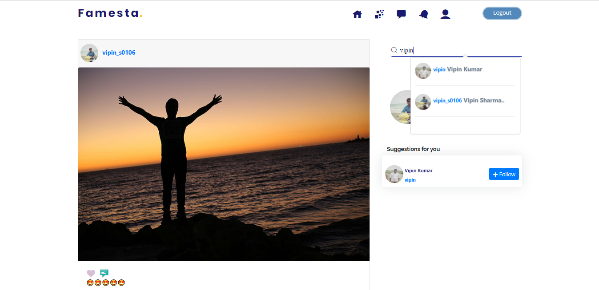
- Feed
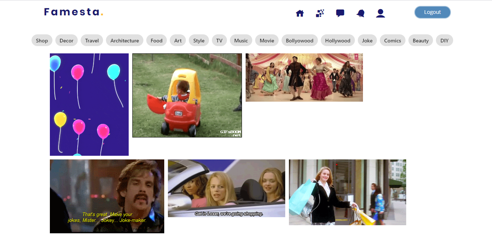
- Chat
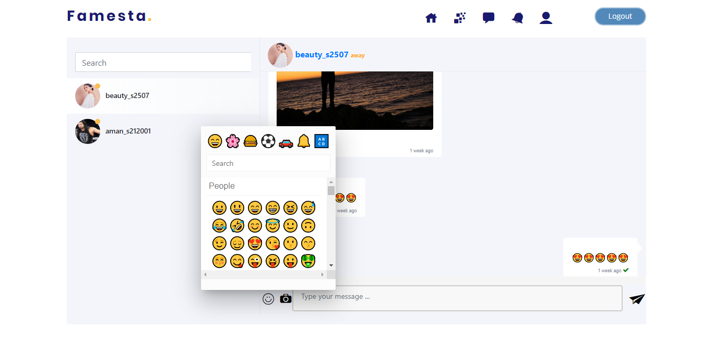
- Notification
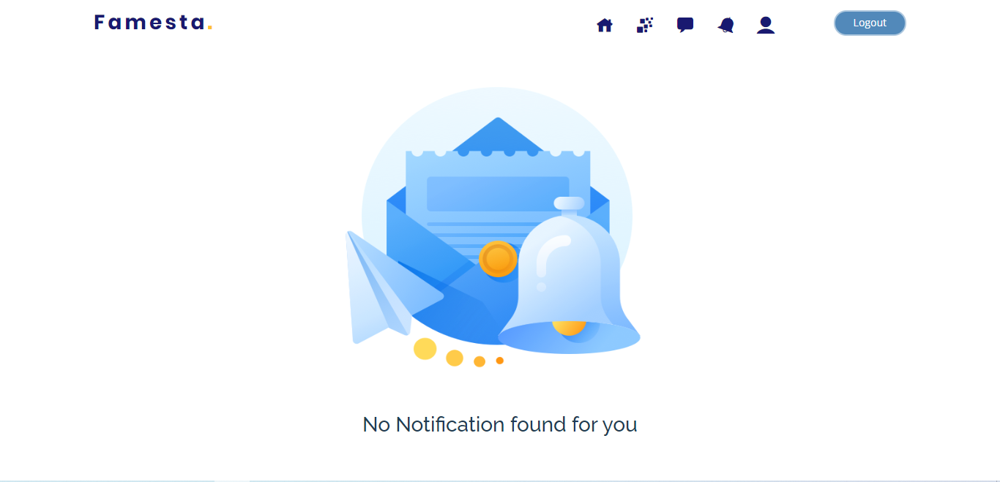
- User Profile
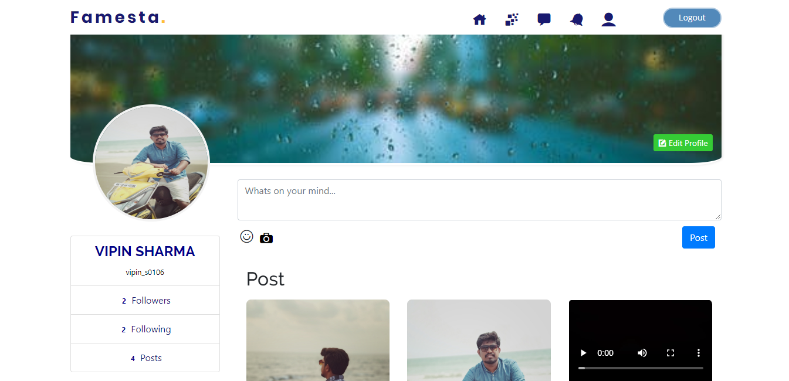
- User Followings/Follower
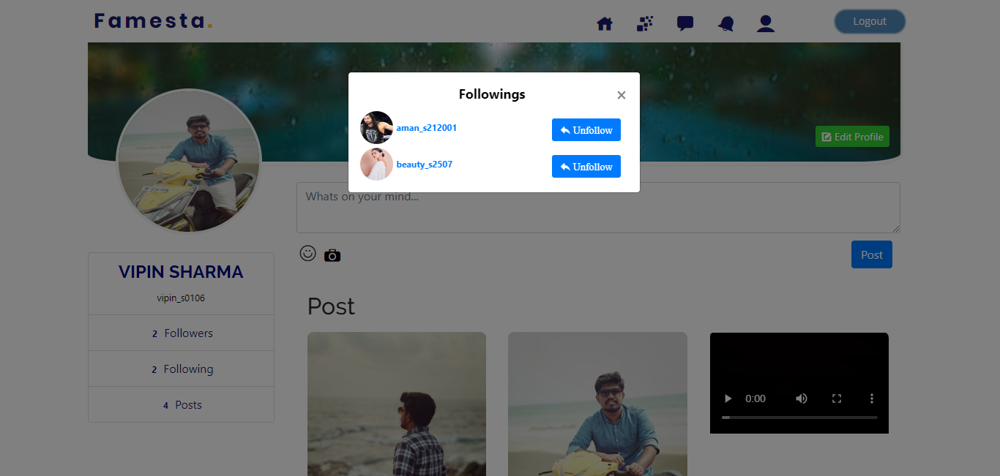
- Edit Profile
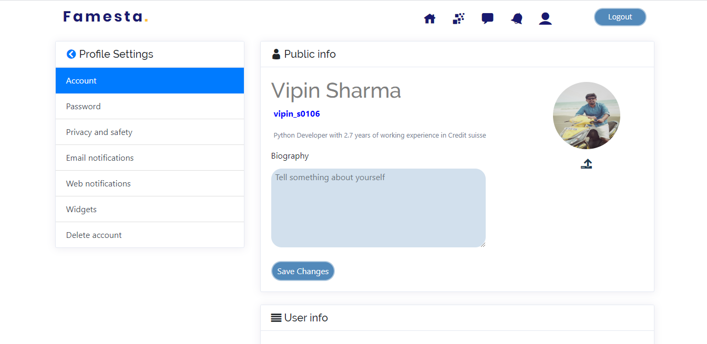
- Story Detail
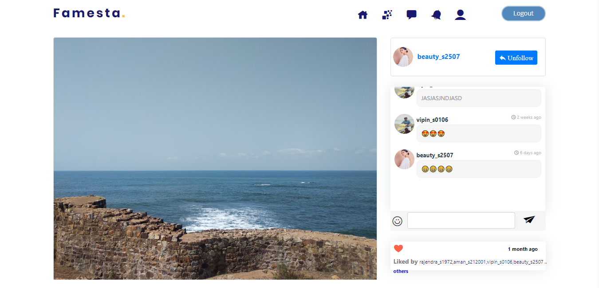
- Other User Profile
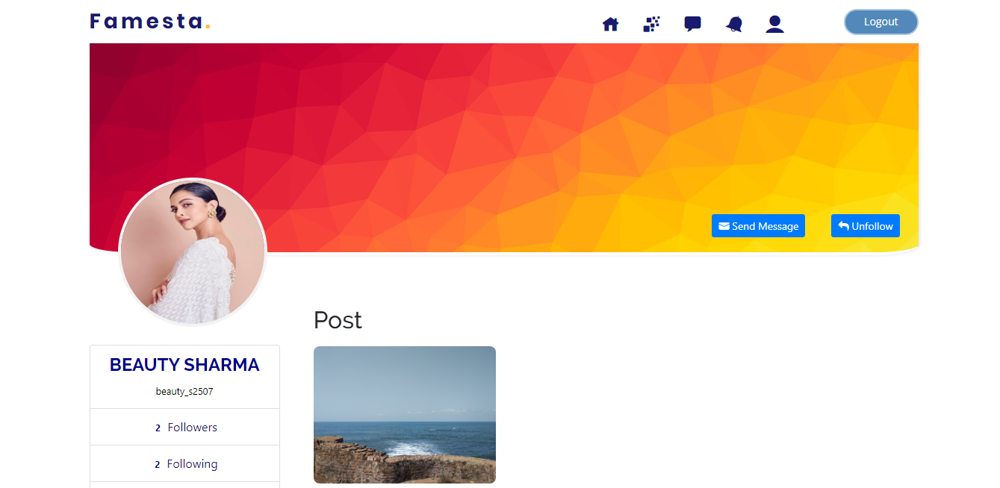
